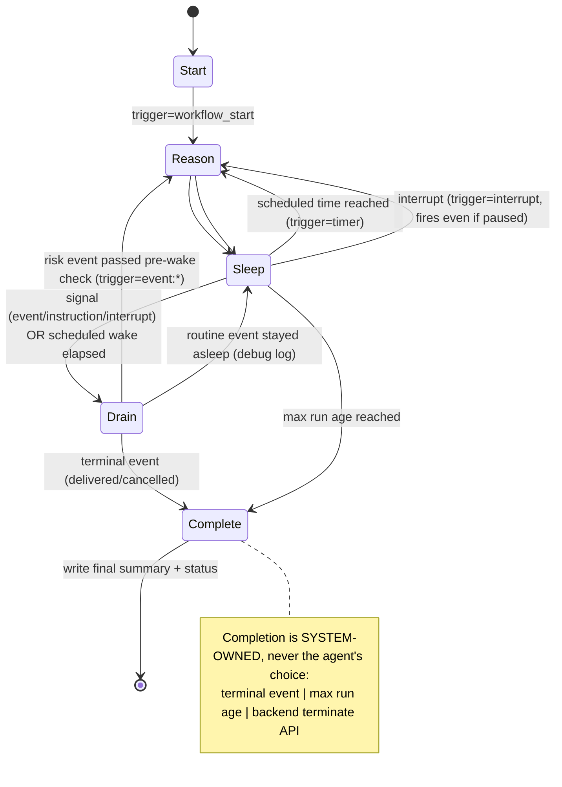

# ARCHITECTURE — Order Supervisor

How the system actually works. Part 1 (application) is implemented and demoed locally; the
cluster component diagram (Part 2) is filled in as the infra lands (Phase 2–4).

## Components (application)

```
┌──────────┐   HTTP    ┌──────────────┐  start/signal/terminate  ┌────────────────┐
│ Next.js  │ ───────►  │  FastAPI     │ ───────────────────────► │ Temporal       │
│ UI       │ ◄───────  │  backend     │ ◄─ query get_status ──── │ frontend :7233 │
└──────────┘  runs/log └──────┬───────┘                          └───────┬────────┘
                              │ reads/writes                             │ task queue
                              ▼                                          ▼
                       ┌─────────────┐                          ┌────────────────┐
                       │ PostgreSQL  │ ◄── activities write ──── │ Temporal       │
                       │ (orderpilot │      (record_entries,     │ worker         │
                       │  + temporal │       update_run_status,  │ (workflow +    │
                       │  + temporal_│       decide_activity)    │  activities)   │
                       │  visibility)│                          └────────────────┘
                       └─────────────┘
```

- **One Postgres** backs both Temporal (its `temporal` / `temporal_visibility` databases, SQL
  visibility, no Elasticsearch) and the app (`orderpilot` database).
- **FastAPI** owns the app DB row creation + reads and the Temporal client (start workflow, send
  signals, terminate). It never runs agent logic.
- **Worker** hosts the workflow and all activities. Side effects (DB writes, the LLM call) only
  happen in activities.

## Workflow lifecycle



The run loop never busy-loops: it blocks in `workflow.wait_condition(..., timeout)` until a
signal arrives or the next scheduled wake elapses (PDF p.1).

### Three inference triggers (PDF p.1)
1. **workflow start** — initial `decide()` (acknowledge the order).
2. **incoming event** — delivered as a Temporal **signal** (`inject_event`).
3. **scheduled timer wake** — the `wait_condition` timeout; default 60s, per-run overridable.

### Pre-wake check (PDF p.2) — `shared.pre_wake_check`
Runs in the workflow before invoking the agent:
- terminal events → handled by the completion path;
- routine progress (`payment_confirmed`, `shipment_created`) → **stay asleep**, log a debug
  line, defer reasoning to the next scheduled wake (the visible "stayed asleep" decision);
- everything else (risk/interaction) → **wake now**;
- an active "escalate everything" instruction forces every event to wake.

### Agent decision (`decide()` — `app/agent/decide.py`)
Pure, deterministic policy. Called only from `decide_activity`. The LLM (Decision #3) is a
single optional call inside that activity that classifies `customer_message_received` text and
feeds the result in as a hint — with a hard fallback to the rules classifier on any failure, so
the system is fully functional with no API key. The three actions are the only side-effecting
outputs and each is written to `activity_log`:
`escalate_to_fulfillment_team`, `send_customer_update`, `add_internal_note`.

### Lifecycle controls (correct Temporal idioms)
- `pause` / `resume` / `interrupt` / `add_instruction` → **Temporal signals**.
- `terminate` → **Temporal terminate API** (not a signal — a sleeping/paused workflow might
  never process one). The backend writes the final summary + flips the run row to `terminated`.

### Decision #9 log-readability refinement
A timer wake records a **normal**-visibility line only when the agent makes a *new* decision.
No-op wakes and repeated unchanged stale-order heartbeats are written at **debug** visibility;
the default UI view (`GET /runs/{id}/log`) hides them, `?include_debug=true` shows them.

## Data model (app DB — `backend/app/schema.sql`)

`runs` — one row per workflow:
`run_id (PK, == workflow id)`, `order_id`, `status` (running|paused|completed|terminated),
`completion_reason`, `wake_interval_s`, `max_run_age_s`, timestamps.

`activity_log` — append-only, one row per event / wake decision / action / instruction /
summary / llm / fallback / lifecycle line:
`id`, `run_id (FK)`, `ts`, `kind`, `action`, `trigger`, `visibility` (normal|debug),
`message`, `payload (jsonb)`. Indexed by `(run_id, id)` and `(run_id, visibility, id)`.

## API surface (FastAPI)

| Method | Path | Purpose |
|---|---|---|
| POST | `/runs` | start a run (order_id, optional wake/maxAge/instructions) |
| GET | `/runs` | list runs (optional `?status=`) |
| GET | `/runs/{id}` | run row + live workflow `get_status` query |
| GET | `/runs/{id}/log` | activity log (`?include_debug=` toggles heartbeats) |
| POST | `/runs/{id}/events` | inject an event (signal) |
| POST | `/runs/{id}/instructions` | add an extra instruction (signal) |
| POST | `/runs/{id}/pause` `/resume` `/interrupt` | lifecycle signals |
| POST | `/runs/{id}/terminate` | Temporal terminate API + summary |
| GET | `/events/types` | event vocabulary for the UI |

## Cluster topology (Part 2 — filled in Phase 2–4)

<!-- TODO(phase2-4): k3s on EC2 single node; Temporal Helm chart (SQL visibility) + Postgres
     StatefulSet (local-path) + backend + worker Deployments; kube-prometheus-stack; worker
     HPA + metrics-server; NodePort API; Temporal Web UI via port-forward only. -->
