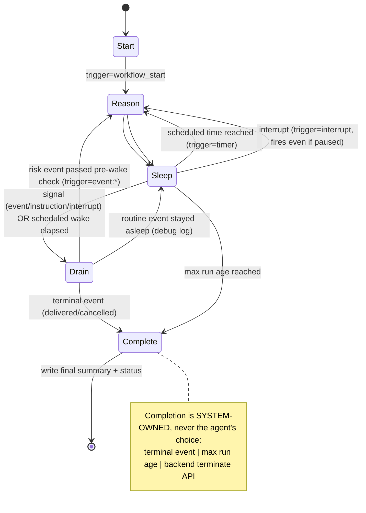

# ARCHITECTURE — Order Supervisor

How the system actually works, end to end — both the **application** (Part 1) and the
**self-hosted infrastructure** it runs on (Part 2). The diagrams are the spine of the video
walkthrough; each maps directly to an assignment requirement.

---

## 1. System design — main components & business flow

```
   ┌─────────┐      ┌──────────────┐      ┌───────────────────┐
   │ Next.js │ ───► │   FastAPI    │ ───► │  Temporal server  │
   │   UI    │ ◄─── │   backend    │ ◄─── │ one workflow /    │
   └─────────┘      └──────┬───────┘      │      order        │
    operator               │ read/write   └─────────┬─────────┘
    (browser)              │                         │ task queue
                           ▼                         ▼
                    ┌──────────────┐      ┌───────────────────┐
                    │  PostgreSQL  │ ◄─── │  Temporal worker  │
                    │ activity log │      │ agent: rules core │
                    │ + Temporal   │      │ + 1 LLM (fallback)│
                    │   store      │      └───────────────────┘
                    └──────────────┘
```

**Business flow — supervising one order:**

1. **Start** — operator starts a run for an order (UI → backend → a new Temporal workflow).
2. **Events arrive** — `payment_failed`, `shipment_delayed`, `customer_message_received`, … are
   injected as Temporal signals.
3. **Pre-wake check** — routine events stay asleep; risk/interaction events wake the agent.
4. **Decide & act** — the agent (rules core, optionally one LLM call) picks an action —
   `escalate_to_fulfillment_team` / `send_customer_update` / `add_internal_note` — written to the
   activity log (shown in the UI).
5. **Sleep & timer wake** — the workflow sleeps, waking on schedule to re-check the order. No
   tight loop.
6. **Completion (system-owned)** — a terminal event (`delivered`/`cancelled`), max run age, or
   manual terminate → a final summary is written to the activity log.

**Main components:**

- **Next.js UI** (runs on the operator's laptop) — start/inspect runs, inject events, add
  instructions, lifecycle controls.
- **FastAPI backend** — relays UI actions to Temporal (start, signals, terminate) and reads
  runs/log from Postgres. It runs no agent logic itself.
- **Temporal server + worker** — one workflow per order; the worker runs the workflow and the
  activities. The agent decision = deterministic rules engine + exactly one guarded LLM call.
- **PostgreSQL** (self-hosted) — backs both Temporal (SQL visibility, no Elasticsearch) and the
  app's activity log.

> Where this runs on AWS (VPC, two k3s nodes, monitoring, HPA, security boundaries) is in
> [§5 Cluster topology](#5-cluster-topology--pod-placement). Tool primers: [AWS.md](AWS.md) ·
> [TERRAFORM.md](TERRAFORM.md) · [MONITORING.md](MONITORING.md) · [AUTOSCALING.md](AUTOSCALING.md).

---

## 2. Workflow lifecycle



The run loop never busy-loops: it blocks in `workflow.wait_condition(..., timeout)` until a
signal arrives or the next scheduled wake elapses (PDF p.1).

### Three inference triggers (PDF p.1)
1. **workflow start** — initial `decide()` (acknowledge the order).
2. **incoming event** — delivered as a Temporal **signal** (`inject_event`).
3. **scheduled timer wake** — the `wait_condition` timeout; default 60s, per-run overridable.

### Pre-wake check (PDF p.2) — `shared.pre_wake_check`
Runs in the workflow before invoking the agent:
- terminal events → handled by the completion path;
- routine progress (`payment_confirmed`, `shipment_created`) → **stay asleep**, log a debug
  line, defer reasoning to the next scheduled wake (the visible "stayed asleep" decision);
- everything else (risk/interaction) → **wake now**;
- an active "escalate everything" instruction forces every event to wake.

### Agent decision (`decide()` — `app/agent/decide.py`)
Pure, deterministic policy. Called only from `decide_activity`. The LLM (Decision #3) is a
single optional call inside that activity that classifies `customer_message_received` text and
feeds the result in as a hint — with a hard fallback to the rules classifier on any failure, so
the system is fully functional with no API key. The three actions are the only side-effecting
outputs and each is written to `activity_log`:
`escalate_to_fulfillment_team`, `send_customer_update`, `add_internal_note`.

### Lifecycle controls (correct Temporal idioms)
- `pause` / `resume` / `interrupt` / `add_instruction` → **Temporal signals**.
- `terminate` → **Temporal terminate API** (not a signal — a sleeping/paused workflow might
  never process one). The backend writes the final summary + flips the run row to `terminated`.

### Decision #9 log-readability refinement
A timer wake records a **normal**-visibility line only when the agent makes a *new* decision.
No-op wakes and repeated unchanged stale-order heartbeats are written at **debug** visibility;
the default UI view (`GET /runs/{id}/log`) hides them, `?include_debug=true` shows them.

## 3. Data model (app DB — `backend/app/schema.sql`)

`runs` — one row per workflow:
`run_id (PK, == workflow id)`, `order_id`, `status` (running|paused|completed|terminated),
`completion_reason`, `wake_interval_s`, `max_run_age_s`, timestamps.

`activity_log` — append-only, one row per event / wake decision / action / instruction /
summary / llm / fallback / lifecycle line:
`id`, `run_id (FK)`, `ts`, `kind`, `action`, `trigger`, `visibility` (normal|debug),
`message`, `payload (jsonb)`. Indexed by `(run_id, id)` and `(run_id, visibility, id)`.

## 4. API surface (FastAPI)

| Method | Path | Purpose |
|---|---|---|
| POST | `/runs` | start a run (order_id, optional wake/maxAge/instructions) |
| GET | `/runs` | list runs (optional `?status=`) |
| GET | `/runs/{id}` | run row + live workflow `get_status` query |
| GET | `/runs/{id}/log` | activity log (`?include_debug=` toggles heartbeats) |
| POST | `/runs/{id}/events` | inject an event (signal) |
| POST | `/runs/{id}/instructions` | add an extra instruction (signal) |
| POST | `/runs/{id}/pause` `/resume` `/interrupt` | lifecycle signals |
| POST | `/runs/{id}/terminate` | Temporal terminate API + summary |
| GET | `/events/types` | event vocabulary for the UI |

## 5. Cluster topology & pod placement

Two t3.medium k3s nodes on AWS (Decision #10), provisioned entirely by Terraform (VPC, subnet,
IGW, security group, 2× EC2 via user-data, ECR; no NAT/EIP/LoadBalancer/EBS-CSI).

### Namespaces
- **`orderpilot`** — our application: the **5 pods** below.
- **`kube-system`** — k3s built-ins we rely on: `coredns` (DNS), `local-path-provisioner` (PV
  storage), `metrics-server` (feeds the worker HPA).
- **`monitoring`** — the Prometheus + Grafana stack (added in Phase 4).

### The 5 application pods (namespace `orderpilot`) and where they run

```
        NODE 1 · t3.medium · k3s SERVER                NODE 2 · t3.medium · k3s AGENT
        
 ┌───────────────────────────────────────────────--┐   ┌───────────────────────────────-┐
 │  postgres-0    StatefulSet  (local-path PV)     │   │  worker     Deployment         │
 │  temporal      Deployment   (auto-setup)        │   │             (HPA 1→4 on CPU)   │
 │  temporal-ui   Deployment   (port-forward only) │   │                                │
 │  backend       Deployment   (NodePort 30080)    │   │                                │
 └───────────────────────────────────────────────--┘   └───────────────────────────────-┘

   k3s built-ins (kube-system) run across both nodes: coredns, local-path-provisioner,
   metrics-server.  App pods are pinned by node role (see rationale below).
```

| Pod | Kind | Node | Role |
|---|---|---|---|
| `postgres-0` | StatefulSet | server | Temporal + app persistence (local-path PV) |
| `temporal` | Deployment | server | Temporal server — auto-setup, SQL visibility, no ES |
| `temporal-ui` | Deployment | server | Temporal Web UI (reached via port-forward only) |
| `backend` | Deployment | server | FastAPI API, exposed on NodePort 30080 |
| `worker` | Deployment | **agent** | workflow + activities; the HPA target (1→4) |

### Placement rationale
- **Node 1 (k3s server)** holds the stateful + control workloads (Postgres, Temporal, backend,
  UI) and the Phase-4 monitoring stack.
- **Node 2 (k3s agent)** holds only the **worker**, the one horizontally-scaled component — pinned
  there (nodeAffinity: not control-plane) so the on-camera HPA load test has headroom without
  starving Temporal/Postgres/monitoring; single-node left only ~300 MiB spare at peak (DESIGN.md #10).
- Storage = k3s **local-path** PVs (no EBS-CSI → nothing orphaned on destroy); re-seedable via
  `scripts/seed_demo.sh`. Temporal uses the `temporalio/auto-setup` image (same as local compose).

### Exposure / security boundaries (graded)

| Surface | Exposure | Reached via |
|---|---|---|
| Backend API | NodePort `30080`, **operator IP /32 only** | Next.js UI / curl |
| Kubernetes API | `6443`, **operator IP /32 only** | `kubectl` + the port-forward tunnels |
| **Temporal frontend `7233`** | **ClusterIP — no SG rule, never internet** | workers + backend, in-cluster |
| Temporal Web UI | **never public** | `kubectl port-forward` → `localhost:8080` |
| Grafana | **never public** | `kubectl port-forward` → `localhost:3001` |
| PostgreSQL | ClusterIP — internal only | Temporal + app, in-cluster |
| Node ↔ node | SG **self-reference only** (`6443`, `10250`, `8472/udp`) | not the internet |

Secrets (Postgres password, optional Gemini key) live in **K8s Secrets** as env vars — never
hardcoded, never committed.

> Plain-language operator walkthrough of every command: [OPERATOR_GUIDE.md](OPERATOR_GUIDE.md)
> (Phase 5). Tool-by-tool primers: [TERRAFORM.md](TERRAFORM.md) · [AWS.md](AWS.md) ·
> [MONITORING.md](MONITORING.md) · [AUTOSCALING.md](AUTOSCALING.md).
