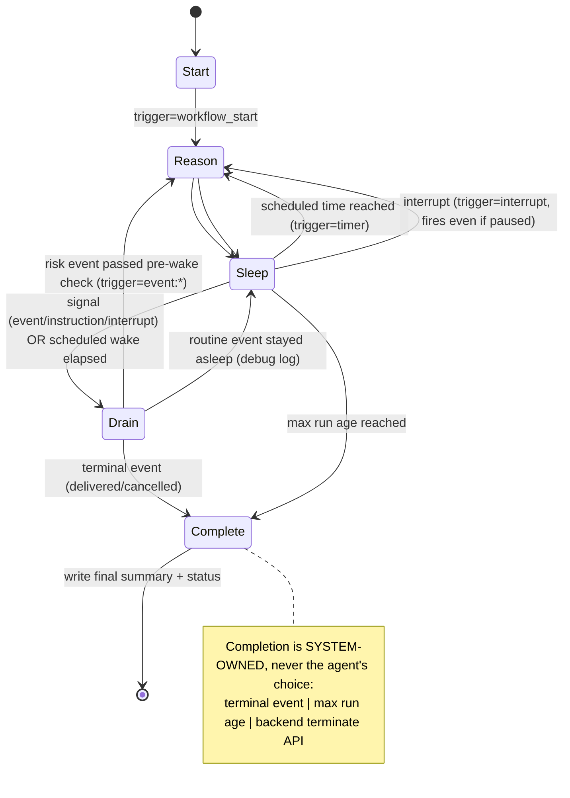

# ARCHITECTURE — Order Supervisor

How the system actually works, end to end — both the **application** (Part 1) and the
**self-hosted infrastructure** it runs on (Part 2). The diagrams are the spine of the video
walkthrough; each maps directly to an assignment requirement.

---

## 1. System design — end-to-end deployment view

This single picture covers both parts: *where* every component runs, *what* talks to *what*, and
*which* surfaces are reachable from outside vs. internal-only.

```
                              OPERATOR LAPTOP  (local only)
 ┌──────────────────────────────────────────────────────────────────────────────────┐
 │  Next.js UI ──HTTP──┐    kubectl / terraform        port-forward tunnels (me only): │
 │  (npm run dev)      │    (kube API :6443)             • Temporal Web UI  :8080      │
 │                     │                                 • Grafana          :3001      │
 └─────────────────────┼─────────────────┬───────────────────────┬────────────────────┘
            NodePort :30080         kube API :6443        tunnels ride the :6443 API
        (SG: my IP /32 only)     (SG: my IP /32 only)     (UIs are NEVER public)
                       │                 │                        │
 ════════════════ AWS  VPC 10.42.0.0/16  ·  ap-south-1  ·  public subnet 10.42.1.0/24 ═══════
 ║  Internet Gateway   |   Security Group (rules above + node-to-node only)   |   ECR repos  ║
 ║                                                                              (backend,    ║
 ║                                                                               worker imgs)║
 ║  ┌───────────────────── NODE 1 · t3.medium · k3s SERVER ──────────────────────┐          ║
 ║  │                                                                            │          ║
 ║  │  FastAPI backend  ──start/signal/terminate──►  Temporal SERVER pod         │          ║
 ║  │   (Deploy, NodePort :30080)                     (auto-setup image):        │          ║
 ║  │        │  ▲ query get_status                     frontend :7233 · history  │          ║
 ║  │        │  └──────────────────────────────┐       · matching · int. worker │          ║
 ║  │        │ reads/writes                     │       SQL visibility, NO ES    │          ║
 ║  │        ▼                                  │            │ persistence       │          ║
 ║  │  PostgreSQL (StatefulSet, local-path PV) ◄┘◄───────────┘                   │          ║
 ║  │   DBs: orderpilot (runs, activity_log) · temporal · temporal_visibility    │          ║
 ║  │                                                                            │          ║
 ║  │  Temporal Web UI (ClusterIP)     Monitoring: Prometheus + Grafana          │          ║
 ║  │                                  + metrics-server  (all ClusterIP)         │          ║
 ║  └───────────────────────────────────────┬────────────────────────────────────┘         ║
 ║                       flannel VXLAN overlay (8472/udp) · cluster pod network              ║
 ║  ┌───────────────────────────────────────┴──── NODE 2 · t3.medium · k3s AGENT ─┐         ║
 ║  │  Temporal WORKER   (Deployment + HPA: 1→4 replicas on CPU)                   │         ║
 ║  │    polls task queue on frontend :7233 · runs workflow + activities          │         ║
 ║  │    decide activity = deterministic RULES engine                             │         ║
 ║  │                      (+ exactly ONE Gemini call for customer messages,       │         ║
 ║  │                       hard fallback to rules → runs with no key)            │         ║
 ║  │    activities write runs/activity_log → PostgreSQL (node 1)                 │         ║
 ║  └──────────────────────────────────────────────────────────────────────────────┘        ║
 ║                                                                                           ║
 ║  Prometheus scrapes Temporal + node/pod metrics  ·  metrics-server feeds the worker HPA   ║
 ═══════════════════════════════════════════════════════════════════════════════════════════
   Everything inside the VPC is provisioned by Terraform: VPC · subnet · IGW · route table ·
   security group · 2× EC2 (k3s via user-data) · ECR · SSH keypair.   `apply` builds it all,
   `destroy` removes it all.  No NAT · no EIP · no LoadBalancer · no EBS-CSI.
```

### Exposure / security boundaries (the graded bits)

| Surface | Exposure | Reached via |
|---|---|---|
| Backend API | NodePort `30080`, **my IP /32 only** | Next.js UI / curl from my laptop |
| Kubernetes API | `6443`, **my IP /32 only** | `kubectl`, and the two port-forward tunnels |
| **Temporal frontend `7233`** | **ClusterIP — no SG rule, never internet-reachable** | workers + backend, in-cluster only |
| Temporal Web UI | ClusterIP — **never public** | `kubectl port-forward` → `localhost:8080` |
| Grafana | ClusterIP — **never public** | `kubectl port-forward` → `localhost:3001` |
| PostgreSQL | ClusterIP — internal only | Temporal + app, in-cluster only |
| Node ↔ node | SG **self-reference only** (`6443`, `10250`, `8472/udp`) | not the internet |

Secrets (Postgres password, optional Gemini key) live in **K8s Secrets**, injected as env vars —
never hardcoded, never committed.

---

## 2. Application components & data flow

```
┌──────────┐  HTTP   ┌──────────────┐  start/signal/terminate  ┌────────────────┐
│ Next.js  │ ──────► │  FastAPI     │ ───────────────────────► │ Temporal       │
│ UI       │ ◄────── │  backend     │ ◄─ query get_status ──── │ frontend :7233 │
└──────────┘ runs/log└──────┬───────┘                          └───────┬────────┘
   event generator          │ reads/writes (runs, activity_log)        │ task queue
   8 event types +          ▼                                          ▼
   cancelled         ┌─────────────┐   activities write       ┌────────────────────┐
                     │ PostgreSQL  │ ◄─── (record_entries, ─── │ Temporal worker    │
                     │ orderpilot  │      update_run_status)   │  workflow loop +   │
                     │ + temporal  │ ◄──── decide activity ─── │  decide activity   │
                     │ + temporal_ │       (rules + 1 LLM      │  (rules engine /   │
                     │  visibility │        call w/ fallback)  │   1 guarded LLM)   │
                     └─────────────┘                          └────────────────────┘
```

- **One Postgres**, three databases: Temporal's `temporal` / `temporal_visibility` (SQL
  visibility, **no Elasticsearch**) and the app's `orderpilot` (`runs`, `activity_log`).
- **FastAPI** owns app-DB reads + run-row creation and the Temporal client (start workflow, send
  signals, terminate). It **never runs agent logic** — it only relays UI actions to Temporal.
- **Worker** hosts the workflow and *all* activities. Every side effect (DB writes, the single
  LLM call) happens inside an activity; workflow code stays deterministic for Temporal replay.
- **Agent decision boundary:** the deterministic **rules engine** is the complete decision core
  and runs inside the `decide` activity; the **one** LLM call (classifying `customer_message_received`
  text) also lives in that activity, behind a hard fallback — so the whole system runs with no
  API key.

### Requirement → where it's satisfied (video cheat-sheet)

| PDF requirement | Where in the system |
|---|---|
| One Temporal workflow per order, 3 inference triggers | `OrderSupervisorWorkflow` — workflow start / signal / timer |
| No tight loop; sleep until time or event | `workflow.wait_condition(timeout=…)` in the run loop |
| Pre-wake check (wake-now vs stay-asleep) | `pre_wake_check` in the workflow before reasoning |
| 3 actions → activity record in Postgres | `decide` → `record_entries` → `activity_log` |
| Lifecycle: interrupt/pause/resume = signals; terminate = API | signals on the workflow; backend calls Temporal terminate |
| Per-run extra instructions after start | `add_instruction` signal → run context → rules overrides |
| System-owned completion (terminal / max age / manual) | run loop + backend terminate; final summary to `activity_log` |
| Event generator (8 events) | `POST /runs/{id}/events`, UI panel |
| Self-hosted Temporal on K8s + self-hosted Postgres | Node 1 pods; SQL visibility, no ES |
| Terraform clean apply/destroy | `terraform/` (Section 1 diagram) |
| Monitoring dashboard | Prometheus + Grafana on Node 1 |
| HPA on the worker + load script | Node 2 worker HPA + `scripts/load_test.sh` |

---

## 3. Workflow lifecycle



The run loop never busy-loops: it blocks in `workflow.wait_condition(..., timeout)` until a
signal arrives or the next scheduled wake elapses (PDF p.1).

### Three inference triggers (PDF p.1)
1. **workflow start** — initial `decide()` (acknowledge the order).
2. **incoming event** — delivered as a Temporal **signal** (`inject_event`).
3. **scheduled timer wake** — the `wait_condition` timeout; default 60s, per-run overridable.

### Pre-wake check (PDF p.2) — `shared.pre_wake_check`
Runs in the workflow before invoking the agent:
- terminal events → handled by the completion path;
- routine progress (`payment_confirmed`, `shipment_created`) → **stay asleep**, log a debug
  line, defer reasoning to the next scheduled wake (the visible "stayed asleep" decision);
- everything else (risk/interaction) → **wake now**;
- an active "escalate everything" instruction forces every event to wake.

### Agent decision (`decide()` — `app/agent/decide.py`)
Pure, deterministic policy. Called only from `decide_activity`. The LLM (Decision #3) is a
single optional call inside that activity that classifies `customer_message_received` text and
feeds the result in as a hint — with a hard fallback to the rules classifier on any failure, so
the system is fully functional with no API key. The three actions are the only side-effecting
outputs and each is written to `activity_log`:
`escalate_to_fulfillment_team`, `send_customer_update`, `add_internal_note`.

### Lifecycle controls (correct Temporal idioms)
- `pause` / `resume` / `interrupt` / `add_instruction` → **Temporal signals**.
- `terminate` → **Temporal terminate API** (not a signal — a sleeping/paused workflow might
  never process one). The backend writes the final summary + flips the run row to `terminated`.

### Decision #9 log-readability refinement
A timer wake records a **normal**-visibility line only when the agent makes a *new* decision.
No-op wakes and repeated unchanged stale-order heartbeats are written at **debug** visibility;
the default UI view (`GET /runs/{id}/log`) hides them, `?include_debug=true` shows them.

## 4. Data model (app DB — `backend/app/schema.sql`)

`runs` — one row per workflow:
`run_id (PK, == workflow id)`, `order_id`, `status` (running|paused|completed|terminated),
`completion_reason`, `wake_interval_s`, `max_run_age_s`, timestamps.

`activity_log` — append-only, one row per event / wake decision / action / instruction /
summary / llm / fallback / lifecycle line:
`id`, `run_id (FK)`, `ts`, `kind`, `action`, `trigger`, `visibility` (normal|debug),
`message`, `payload (jsonb)`. Indexed by `(run_id, id)` and `(run_id, visibility, id)`.

## 5. API surface (FastAPI)

| Method | Path | Purpose |
|---|---|---|
| POST | `/runs` | start a run (order_id, optional wake/maxAge/instructions) |
| GET | `/runs` | list runs (optional `?status=`) |
| GET | `/runs/{id}` | run row + live workflow `get_status` query |
| GET | `/runs/{id}/log` | activity log (`?include_debug=` toggles heartbeats) |
| POST | `/runs/{id}/events` | inject an event (signal) |
| POST | `/runs/{id}/instructions` | add an extra instruction (signal) |
| POST | `/runs/{id}/pause` `/resume` `/interrupt` | lifecycle signals |
| POST | `/runs/{id}/terminate` | Temporal terminate API + summary |
| GET | `/events/types` | event vocabulary for the UI |

## 6. Cluster topology & pod placement

The full topology is the **Section 1** diagram. Placement rationale (two t3.medium, Decision #10):

- **Node 1 (k3s server)** holds the stateful + control-plane-ish workloads: Temporal server,
  PostgreSQL, the backend, the Temporal Web UI, and the monitoring stack.
- **Node 2 (k3s agent)** holds the **Temporal worker**, which is the only horizontally-scaled
  component (HPA 1→4). Isolating it gives the on-camera HPA load test headroom without starving
  Temporal/Postgres/monitoring — single-node left only ~300 MiB spare at peak (see DESIGN.md #10).
- Storage is k3s **local-path** PVs (no EBS-CSI → nothing orphaned on destroy); data is
  re-seedable via `scripts/seed_demo.sh`.
- Temporal runs the `temporalio/auto-setup` image (same as our local compose) — one pod running
  the server services with **SQL visibility, no Elasticsearch** (Decision #6).

> Plain-language operator walkthrough of every command: [OPERATOR_GUIDE.md](OPERATOR_GUIDE.md)
> (Phase 5). Tool-by-tool primers: [TERRAFORM.md](TERRAFORM.md) · [AWS.md](AWS.md) ·
> [MONITORING.md](MONITORING.md) · [AUTOSCALING.md](AUTOSCALING.md).
